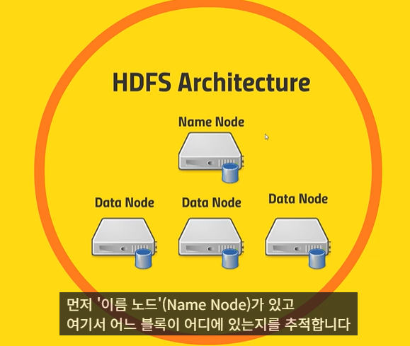
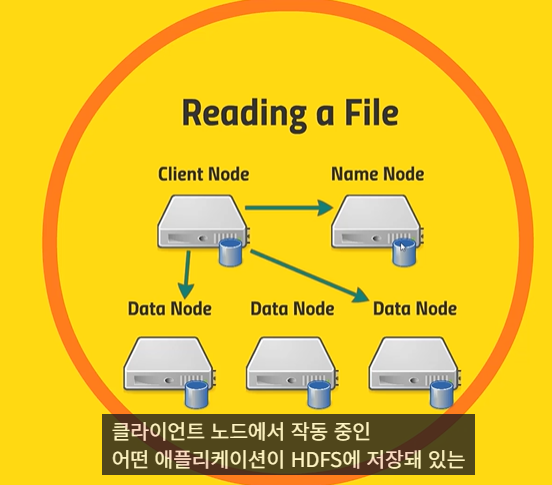

##### hdfs에서 다루는 데이터
- 대용량 파일은 센서나 웹 서버 등으로부터 받아오는 정보의 로그 등

##### 작동순서
- 파일 원본 -> 데이터 블록으로 쪼개어 여러 컴퓨터에 저장( 블록당 기본값 128mb ), 이 때 모든 블록마다 두 개 이상의 복사본을 저장하여 백업이 되도록 함 
즉, hdfs는 분산저장을 하지 이걸 다시 종합해서 어딘가로 처리하는건 다른 친구가 하게되는거임( 아마 yarn or mapreduce)

##### HDFS 아키텍쳐

- Name node
    이 node에서 어느 블록이 어디에 있는지를 추적 ( 데이터 노드에 대해 무엇이 있는지 기록이 돼있음)
    - '편집 로그'(edit log)
        무엇이 생성되고, 어떤 게 수정되고 저장되는지 등의 정보가 기록됨
        이걸 통해 추후에 처리 및 호출 시 추적할 수 있는듯

    - Data node
        실제 파일의 블록을 저장하고 있는 곳

##### HDFS에서 파일을 읽는 예시

클라이언트 노드에서 어떤 애플리케이션을 통해 Name node에게 파일 A가 필요하다 함 -> Name Node가 어떤 Data node들에 어떤 블록에 파일 A의 블록들이 저장돼있는지 알려줌 -> 클라의 그 어떤 애플리케이션이 블록들을 가져와 파일 A를 구성해줌

종합하자면,

'이름 노드'에게 그 파일이 어떤 '데이터 노드'의 어느 블록에 있는지

어떤 '데이터 노드'에 가는 게 가장 효율적인지 등을 물어보면

'이름 노드'가 어디 어디로 가야 한다고 알려준다

##### HDFS에서 새 파일을 만드는 예시

파일을 쓰려고 할 때, 먼저 '이름 노드'에게 얘기하면 이러이러한 '데이터 노드'에 저장하라고 정해줍니다

클라이언트는 그중 첫 번째 '데이터 노드'에게 데이터를 전달하면 그 '데이터 노드'는 블록을 저장하고

그리고

다음 '데이터 노드'에 복사본을 전달하고

그다음 노드에 다시 전달합니다

최종적으로 모든 '데이터 노드'에 파일이 성공적으로 복사되면

잘 받았다는 수신 신호가 전달되어 클라이언트를 통해 '이름 노드'로 전달됩니다

그러면 그 파일이 잘 저장됐다고 기록

- 파일 읽기 및 쓰기 시 한 번에 하나의 이름 노드만 사용해야함
-> 블록의 위치에 관해 클라이언트 간에 혼선이 생길 수 있기 때문

- Name node가 한개라면 문제가 생기는 경우에는 어떻게?

    - Name node가 편집 로그를 로컬 디스크와 **NFS(네트워크 파일 시스템)**에 동시에 작성하도록 구성
    이때 NFS는 다른 랙이나 데이터 센터의 '백업 데이터 저장소'와 연결돼있음 -> 이름노드가 다운돼도 NFS 백업에서 편집 로그라도 살릴 수 있음 -> 이후 새 이름 노드를 만들어 살아난 편집 로그를 사용해 부트스트랩가능
        - NFS를 통해 파일 시스템을 서버에 연결하듯이 NFS 게이트웨이를 통해 HDFS를 리눅스 박스에 연결가능

    - 이차적 이름 노드 운영
        - 주 이름 노드의 편집 로그 복사본을 유지

    - HDFS 연합
        - HDFS 파일 구조 내에 명칭 공간 볼륨(namespace volume)이라고 부르는 서브디렉터리마다 분리된 이름 노드를 지정 -> 이름 노드의 업무를 분담

    -  HDFS 고가용성(High Availability)을 사용해 동적 예비 이름 노드를 운영
        - 공유 편집 로그에 이름 노드가 HDFS가 아닌 다른 안전한 공유 저장소에 편집 로그를 작성

        - Zookeeper는 모든 클라이언트들이 한 번에 하나의 이름 노드만 사용하도록 통제
        -> 근데 이 때 실패해서 두 개의 이름 노드가 동시에 작동되면 ㅈ댐
            -> 이걸 HDFS 고가용성 사용 시 사용하지 않는 이름노드의 전원을 물리적으로 차단가능해버림 

