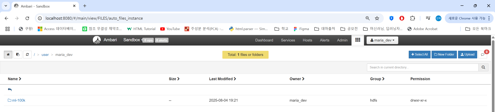
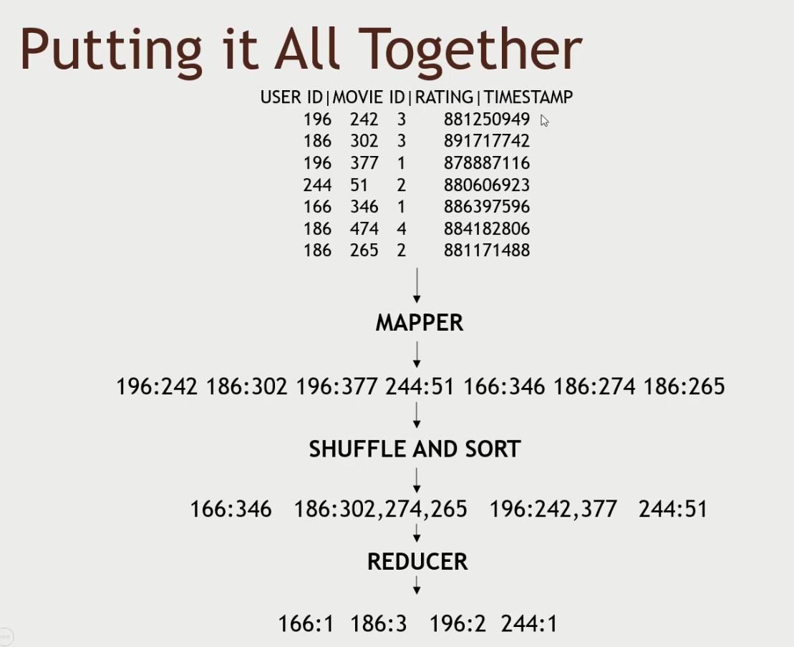

### putty
PuTTY는 무료·오픈소스 터미널 에뮬레이터이자 SSH/Telnet 클라이언트로, 원격 서버 · 네트워크 장비 · 시리얼 콘솔에 접속할 때 가장 널리 쓰이는 Windows용 도구

hadoop fs -copyFromLocal u.data ml-100k/u.data
- u.data 파일을 HDFS에 복사합니다..
- `hadoop fs -copyFromLocal` 명령은 로컬 파일 시스템에서 HDFS로 파일을 복사하는 데 사용됩니다.

hadoop fs -ls ml-100k
- ml-100k 디렉토리의 파일 목록을 확인합니다.

hadoop fs -rm ml-100k/u.data
- ml-100k 디렉토리에서 u.data 파일을 삭제합니다.

hadoop fs -rmdir ml-100k
- ml-100k 디렉토리를 삭제합니다.

### mapreduce 요약

매퍼는 데이터를 변환하고 리듀서는 데이터를 집계합니다

